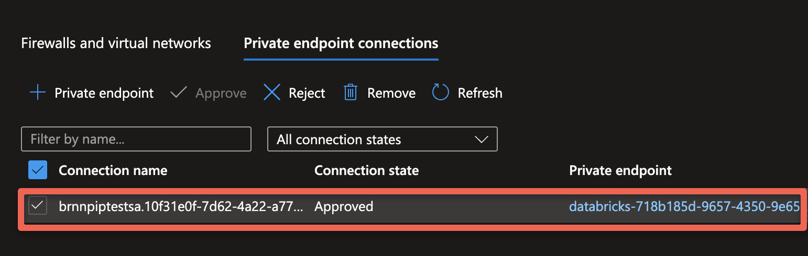

# serverless-pl-tool

The Serverless Secure Connectivity feature enables you to securely connect your
Serverless clusters with backend resources such as Azure Data Lake Storage (ADLS)
accounts and external Hive Metadata Store.
With this feature you can:

1. Configure Azure Storage firewall to constrain access to Databricks Serverless
runtime based on a set of stable subnet IDs (Service Endpoints) associated
with your Workspace.
1. Configure dedicated and private connectivity using Azure Private Link to
cloud backends such as:

    1. Azure Storage
    2. Azure SQL (external Hive Metadata Store)

The serverless-pl tool helps with handling the REST-API and process to create serverless private endpoints and also generating service endpoints (stable end point) for storage firewall if private endpoints are not needed. 

##  Setup : 
1. Python packages : You will need to install the MSAL for python package for Python version 3 (pip install MSAL), all other packages should be built in. 
2. Credentials : Access to the accounts API is done through getting a bearer token for the Databricks service. Since we are using MSAL, you have 3 options for authenticating to Databricks : 
   1. Service Principal (*default*)
   2. User device code 
   3. Username and Password
   4. *Device Code and Username / Password cache and use a refresh token to prevent constant re-authentication*
   
### Credential files
Each option for authentication uses a JSON file. By default the application uses a file called credential.json, but you can use a different file or files for different authentication methods or users using the `-l or --login_type` option for the mode (sp, device or user) and the `-f or --config` option for the filename. A sample credential file is in the repo, edit it accordingly and rename to credential.json. 

For All of these different types credential files, you can also add as an option you account ID since its used in almost every command. If you include it stall can be overridden by using the `-a or --accountId` option.

Examples: 
__Service Principal (sp)__

            {
                "accountId" : "(Optional) your account ID",
                "tenant" : "your tenant id",
                "client_id" : "sp client id",
                "client_secret" : "sp secret"
            }
__Device Code (device)__

            {
                "accountId" : "(Optional) your account ID",
                "tenant" : "your tenant id",
                "client_id" : "application / sp client id",
                "username" : "(Optional) username"
            }
            
__User / Password (user)__

            {
                "accountId" : "(Optional) your account ID",
                "tenant" : "your tenant id",
                "client_id" : "application / sp client id",
                "username" : "username"
                "password" : "password"
            }

> [!IMPORTANT]
> *Please follow the Microsoft doc (https://learn.microsoft.com/en-us/azure/databricks/dev-tools/app-aad-token) for instructions on setting up user auth in Azure.*

## Definitions 
__NCC or Network Connectivity Config__ : 
The NCC or Network Connectivity Config is a confoguration object that can be attached to one or more workspaces in the serverless compute plane. NCCs are region specific. Think of it as a package of configuration data for service endpoints (Stable Endpoints)and Private Endpoints. A customer may hae just one per region or one per business unit or modality. 

__Stable Endpoint__ :
Stable Endpoints are for now service endpoints that are tied to a workspace in the region that are guaranteed to never change once declared and assigned. As a service endpoint they are still relying on public IPs but have a higher order of precedence for routling that give them a preferred, private route between source and target. But they are still a shared object as opposed to private endpoints but also don't have the costs associated with private endpoints.  

__Private Endpoint__ : 
Private end points are a direct source to target communication, using RFC 1918 IPs (non-public). Private Endpoints are the most secure type of commnunication but do have a significant cost associated with them. 

__Serverless Compute__ : 
Literally the serverless data plane, which runs in the Databricks tenant. It cannot access anything in the customer's tenant unless its either publicly accessible, has service endpoints setup or uses a private endpoint to access. Control plane to serverless compute comms use private IP communications. 

__Commands and Options__ : 
I have dumped out the -h or --help page from the tool below. Commands are called by using the `-C` switch with options. If you want to find out what are the nescessary options for a command, just run the command without any options and it will show you the the command line options. 

        Example : serverless-pl$ python3 serverlesspl.py -C get_ncc_by_resource
        Missing Parameters : 
        serverlesspl.py -C get_ncc_by_resource [-a|--accountId ACCOUNT-ID] -r|--resourceId RESOURCE-ID -t|--type RESOURCE-TYPE [--nccname NAME-OF-NCC]

> ![IMPORTANT] 
> Any option in brackets is optional. Some commands will prompt you to procede, these are commands that change the NCC, or workspace environment. You can override this feature with a `-I or --noprompt` option - this is for scripting. But its then your responsibility to make sure you have things right before you run a command.

One last thing, commands that create a private end point `create_serverless_private_link` and `create_pe` will check to see if the resource id of the object you are wanting to create a private endpoint for, already has a private endpoint setup in a NCC. You will be promted to add a` -F` or `--force` flag to override this check. 

    Example : python serverlesspl.py -C create_serverless_private_link -r /subscriptions/xxxxxxx-xxxxxx-xxxx-xxxx-xxxxxxxxx/resourceGroups/databricks-demo/providers/Microsoft.Storage/storageAccounts/mystoarge -t dfs -w 5205279068054683
    /subscriptions/xxxxxxx-xxxxxx-xxxx-xxxx-xxxxxxxxx/resourceGroups/databricks-demo/providers/Microsoft.Storage/storageAccounts/mystoarge was found in NCC d9e29d2e-b18f-4abc-8fb6-443f2b5b773b
    Either add or replace NCC d9e29d2e-b18f-4abc-8fb6-443f2b5b773b or use the -F or --force flag to override.

This feature is designed to check on proliferation of private endpoints, and force you to check if you *really* need that private endpoint. 

## Process : 

__NCC Setup (ensure_workspace_ncc() or create_serverless_private_link())__

- [Step 1] Create a Network Connectivity Config
- [Step 2] Attach the NCC object to one or more workspace
   
__Service (Stable) Enpoints :__ 

__ensure_workspace_ncc()__
- [Step 1] View the subnet IDs that applies to the workspace
- [Step 2] Add subnets to the firewall of the customer storage account.
   
__Private End Points__

__create_serverless_private_link()__ 
- [Step 1] Create the Azure Private Endpoint rule
- [Step 2] Ensure the private endpoint is successfully created
- [Step 3] Approve the private endpoint (in the Azure Portal)
- [Step 4] Refresh the private endpoint status in Databricks (__get_ncc()__)

## Tutorial

### Create a private endpoint

Using the `create_serverless_private_link` command, it will perform the necessary steps to check if a host already has an NCC, verify if your resource ID has a private end point setup already, if needed create a NCC and attach it to your workspace. The minimum set of options for this command are : 

    -r or --resourceId 
    -t or --resourceType
    -w or --workspaceId

The full command line options are : 

    serverlesspl.py -C create_serverless_private_link [-a|--accountId ACCOUNT-ID] -w|--workspaceId WORKSPACE-ID -r|--resourceId RESOURCE-ID -t|--type RESOURCE-TYPE [--nccname NAME-OF-NCC][-F or --force][-I or --noprompt]`

You can add you account number if you didn't add it in the credential file, create a custom name for the NCC. Also as descussed ealier in this doc the optional -I or --nprompt and -F or --force if needed. 

You will add the resource ID and type (blob, dfs) of the storage account or SQL and the workspace ID. 

Run the command : 

    serverlesspl.py -C create_serverless_private_link -r /subscriptions/xxxxxxx-xxxxxx-xxxx-xxxx-xxxxxxxxx/resourceGroups/databricks-demo/providers/Microsoft.Storage/storageAccounts/mystoarge -t dfs -w 5205279068054683

    creating new NCC
    You are about to add a new NCC ncc_jwffgsi_westus and private endpoint to workspace bootcamp-plink serverless compute networking config.
    OK to continue [Y/N]? Y

    Adding NCC to workspace
    Creating Private Endpoint
    Please Approve your private endpoint and run get_ncc command  for NCC id xxxxxx-xxxx-xxxx-xxxx-xxxxxxxxxxx once approved

Approve the private  endpoint

you will be prompted to approve the private end point in Azure. 

Once approved come back to this tool and run the `get_ncc` command to update the private end point metadata and set the config 

    serverlesspl.py -C get_ncc -n d9e29d2e-b18f-4abc-8fb6-443f2b5b773b
    Name : ncc_76876ggh_endpoint
    Region : eastus

    service (stable) endpoints
    ------------------------
    /subscriptions/8453a5d5-9e9e-40c7-87a4-0ab4cc197f48/resourceGroups/prod-azure-eastus-nephos2-xr/providers/Microsoft.Network/virtualNetworks/kaas-vnet/subnets/worker-subnet
    /subscriptions/8453a5d5-9e9e-40c7-87a4-0ab4cc197f48/resourceGroups/prod-azure-eastus-nephos4-xr/providers/Microsoft.Network/virtualNetworks/kaas-vnet/subnets/worker-subnet
    /subscriptions/8453a5d5-9e9e-40c7-87a4-0ab4cc197f48/resourceGroups/prod-azure-eastus-nephos5-xr/providers/Microsoft.Network/virtualNetworks/kaas-vnet/subnets/worker-subnet
    /subscriptions/8453a5d5-9e9e-40c7-87a4-0ab4cc197f48/resourceGroups/prod-azure-eastus-nephos6-xr/providers/Microsoft.Network/virtualNetworks/kaas-vnet/subnets/worker-subnet
    /subscriptions/8453a5d5-9e9e-40c7-87a4-0ab4cc197f48/resourceGroups/prod-azure-eastusc3-nephos3/providers/Microsoft.Network/virtualNetworks/kaas-vnet/subnets/worker-subnet
    /subscriptions/8453a5d5-9e9e-40c7-87a4-0ab4cc197f48/resourceGroups/prod-azure-eastusc3-nephos5/providers/Microsoft.Network/virtualNetworks/kaas-vnet/subnets/worker-subnet
    /subscriptions/8453a5d5-9e9e-40c7-87a4-0ab4cc197f48/resourceGroups/prod-azure-eastusc3-nephos6/providers/Microsoft.Network/virtualNetworks/kaas-vnet/subnets/worker-subnet
    /subscriptions/8453a5d5-9e9e-40c7-87a4-0ab4cc197f48/resourceGroups/prod-azure-eastusc3-nephos7/providers/Microsoft.Network/virtualNetworks/kaas-vnet/subnets/worker-subnet

    private endpoints
    ------------------------
    rule_id : 42924a88-4f83-44e0-b9f2-a5f99730b378
    network_connectivity_config_id : d9e29d2e-b18f-4abc-8fb6-443f2b5b773b
    resource_id : /subscriptions/xxxxxxx-xxxxxx-xxxx-xxxx-xxxxxxxxx/resourceGroups/databricks-demo/providers/Microsoft.Storage/storageAccounts/mystoarge
    group_id : blob
    endpoint_name : databricks-d9e29d2e-b18f-4abc-8fb6-443f2b5b773b-pe-d55845cd
    connection_state : ESTABLISHED
    creation_time : 1691592754558
    updated_time : 1691592754558
    
    -----

### Setup a stable endpoint / attach a NCC to a workspace

Using the `ensure_workspace_ncc` command, it will perform the nesessary steps to check if a host already has an NCC, if needed create a NCC and attech it to your workspace. The minimum set of options for this command are : 

    -w or --workspaceId

The full command line options are : 

    serverlesspl.py -C ensure_workspace_ncc [-a|--accountId ACCOUNT-ID] -w|--workspaceId WORKSPACE-ID

### Options and Commands
__serverless-pl tool usage:__
          
__options :__

__-h or --help :__ this page

__--logout :__ Removes cached login and refresh token for use and device (see README)

__-v :__ verbose output - expands some command outputs from lists to whole json docs

__-C or --command :__ See commands below - each command performs a distinct action for serverless private link

__-w or --workspaceId :__ The workspace ID

__-a or --accountId :__ The Account ID from UC account console

__-n or --nccId :__ The ID of the NCC (network config) object

__-l or --login_type :__ Default service principal. Choose between Device code login (device), Username / Password (user), or Service Principal (sp) See README

__-f or --config :__ Default credential.json, JSON file for holding user / sp

credentials (See README)

__-I or --noprompt :__ Run in non-interactive mode, do not prompt. Nor scripts etc.

__-F or --force :__ Override default behavior to stop on a config issue

__--nccname :__ Unique name for the NCC object

__--region :__ Azure region, example: eastus, westus, westus2

__-r or --resourceId :__ The resource ID of the storage account/sql db you wish to create a private end point to

__-t or --type :__ The type of resource, dfs or blob or SqlServer

__commands :__ (use with -C or --command)

>__create_serverless_private_link :__ <u>Main command to use</u>. Creates
a private endpoint for storage or SQL and attaches to, or updates a workspace. If you include an existing NCC id it will update that NCC and add it to the workspace or replace an existing NCC.
>
>__ensure_workspace_ncc :__ Gets the NCC ID for a given workspace if the workspace does not have an NCC, create and attach a new NCC. Can be used for stable endpoints if no private endpoint is desired.

__Utility Commands :__

>__attach_workspace :__ Attach a NCC (network config) to a workspace
>
>__get_stable_ep :__ Gets the stable service endpoints for a given workspace to be used for storage firewall
>
>__get_ncc :__ Gets details about a NCC, also used to "lock in" the PE
info to a NCC after the PE is approved. Also "sets" the NCC after a change has been made to the NCC. 
>
>__get_workspace_ncc :__ Gets the NCC ID for a given workspace
>
>__create_ncc :__ Creates a blank NCC (network config) object and returns its NCC id
>
>__create_pe :__ Creates a new private endpoint in a NCC (network config)
object
>
>__get_ncc_list :__ Gets a list of NCCs in the account (tenant)
>
>__get_workspace :__ Gets details about a given workspace including the NCC id if its attached
>
>__delete_ncc :__ deletes a NCC (network config) object (Note: may not be able to delete NCCs with active private endpoints)

